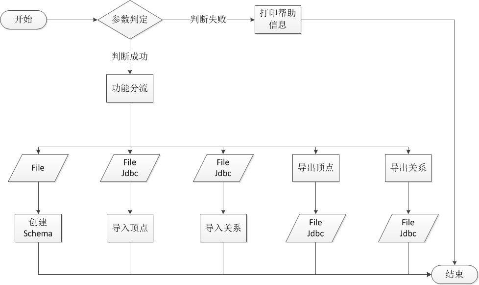

# janusgraph-utils

## JanusGraph配置说明
<details>

<summary>Graph配置</summary>

- graph.set-vertex-id=true
    - 是否自定义ID, 默认false
- gremlin.graph=org.janusgraph.core.JanusGraphFactory
    - graph主入口
- storage.backend=hbase
    - hbase存储方式
- storage.hostname=127.0.0.1:2181
    - hbase存储 Zookeeper地址
- storage.hbase.table=nn:graph
    - hbase存储表空间:表名
- storage.hbase.ext.zookeeper.znode.parent=/hbase
    - hbase存储在Zookeeper的家目录
</details>
<details>

<summary>Cache配置</summary>

- cache.db-cache = true
- cache.db-cache-clean-wait = 20
- cache.db-cache-time = 180000
- cache.db-cache-size = 0.5
</details>
<details>

<summary>Index配置</summary>

- index.search.backend=elasticsearch
- index.search.hostname=127.0.0.1
- index.search.port=9200
- index.search.elasticsearch.client-only=true
- index.search.elasticsearch.local-mode=true
</details>

> JanusGraph+Hbase+Es简易模板
```shell
graph.set-vertex-id=true
gremlin.graph=org.janusgraph.core.JanusGraphFactory
storage.backend=hbase
storage.hostname=127.0.0.1:2181
storage.hbase.table=nn:graph
storage.hbase.ext.zookeeper.znode.parent=/hbase

cache.db-cache=true
cache.db-cache-clean-wait=20
cache.db-cache-time=180000
cache.db-cache-size=0.5

index.search.backend=elasticsearch
index.search.hostname=127.0.0.1
index.search.port=9200
index.search.elasticsearch.client-only=true
index.search.elasticsearch.local-mode=true
```

## JanusGraph数据导入导出及Schema创建

此包中对janusgraph-api作了简单包装, 仅供学习参考使用.

# Schema创建注意事项
- 复合索引可能是唯一索引。
- 外部索引不能是唯一索引。
- 复合索引中PropertKey不能存在Parameter.
- 外部索引中PropertKey可以存在或不存在Parameter.

# 功能流程图


# 数据校验流程图
